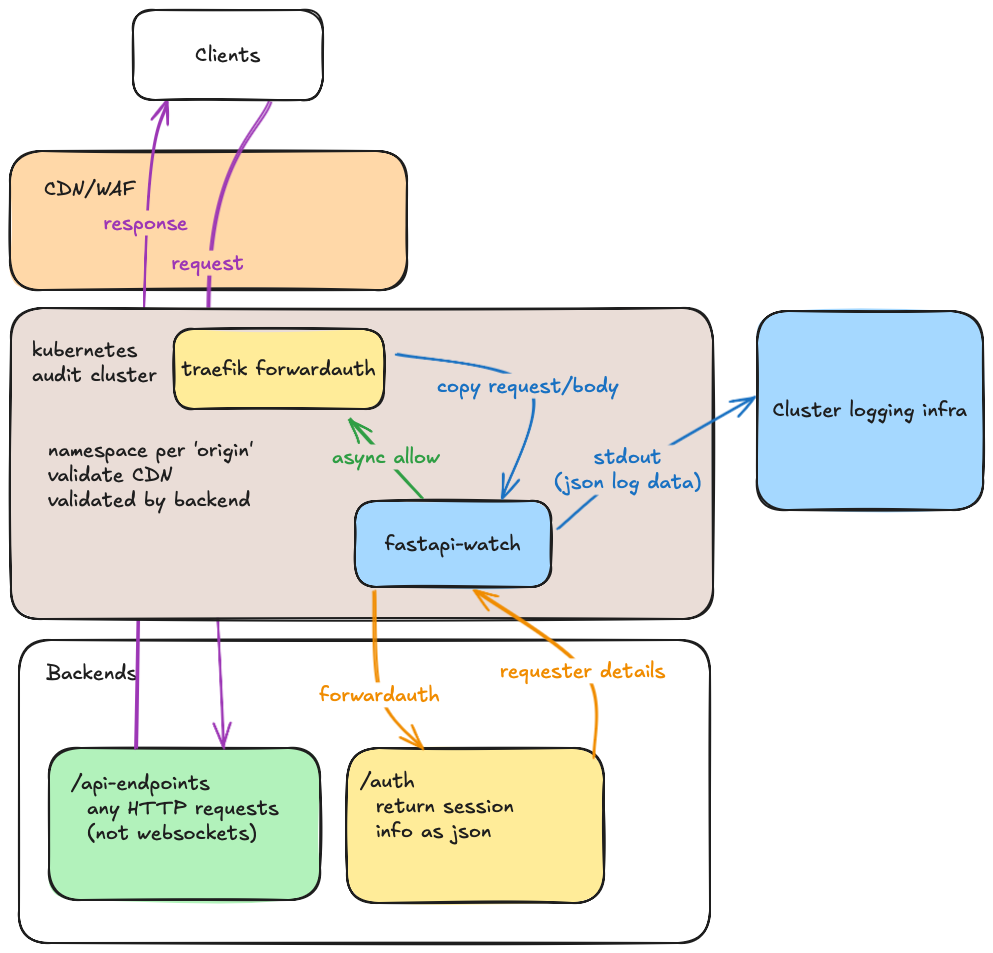

# fastapi-watch

audit passed http requests with traefik and fastapi (to enable enhanced logging)

## Overview

The justfile in this repository should be able to build am audit namespace on a kubernetes cluster, that can be configured to pass requests to any origin which has a path for adding requester information to a request. In parallel to passing requests, the backend should be queried and the correlated request information logged as clean json for further processing by the kubernetes cluster hosting the audit namespace.

## Roadmap

- [ ] Cleanly convert request into json for logging
- [ ] Add header validation for CDN/WAFs
- [ ] Call separate origin path and add info to logs
